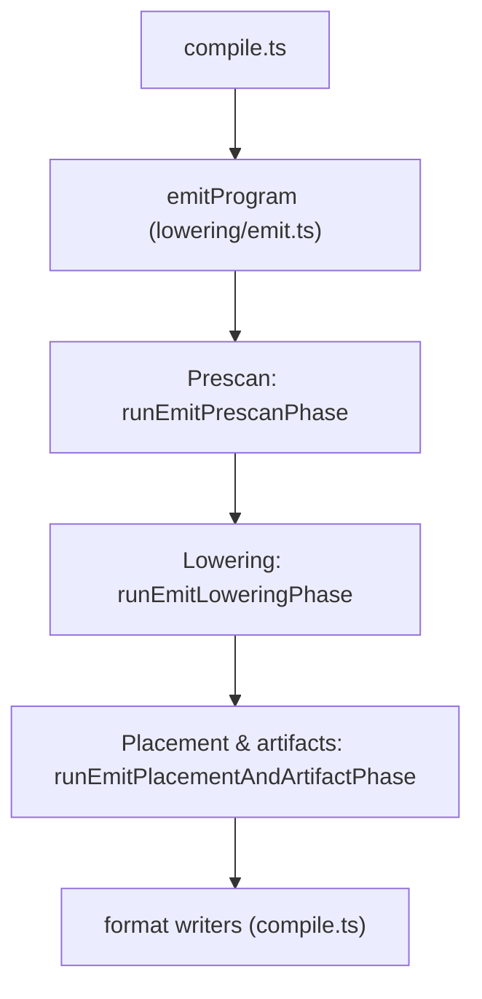

# Lowering Flow (Current)

This document describes the **current** lowering pipeline as implemented on `main`. It is a
reference for maintainers and reviewers, not a future design proposal.

## Entry points

- `compile.ts` calls `emitProgram(...)`.
- `emitProgram` lives in [`src/lowering/emit.ts`](../../src/lowering/emit.ts) and orchestrates the
  lowering pipeline via [`emitPipeline.ts`](../../src/lowering/emitPipeline.ts).

## Pipeline phases (what happens where)

| Phase                    | Owner                                                                             | Purpose                                                                                                                         | Primary outputs                                              |
| ------------------------ | --------------------------------------------------------------------------------- | ------------------------------------------------------------------------------------------------------------------------------- | ------------------------------------------------------------ |
| 1. Workspace setup       | `emit.ts`, `emitPhase1Workspace.ts`, `emitPhase1Helpers.ts`                       | Build mutable maps, section offsets, symbol sets, and function-lowering helpers. Wires the shared context used by later phases. | `EmitPhase1Workspace` and program/function lowering contexts |
| 2. Prescan               | `emitPipeline.runEmitPrescanPhase` → `programLowering.preScanProgramDeclarations` | Discover callables, ops, module-scope storage aliases, raw-address names.                                                       | `PrescanResult` (visibility + storage metadata)              |
| 3. Lowering              | `emitPipeline.runEmitLoweringPhase` → `programLowering.lowerProgramDeclarations`  | Walk module declarations and functions, emit bytes into section maps, enqueue fixups, record lowered ASM trace.                 | `LoweringResult` (bytes, offsets, pending symbols, fixups)   |
| 4. Placement & artifacts | `emitFinalization.finalizeEmitProgram`                                            | Place named sections, resolve fixups, merge byte maps, assemble artifacts.                                                      | `EmittedByteMap`, symbol table, placed lowered ASM           |

## Key files and responsibilities

| File                                                                                               | Role                                                                                       |
| -------------------------------------------------------------------------------------------------- | ------------------------------------------------------------------------------------------ |
| [`src/lowering/emit.ts`](../../src/lowering/emit.ts)                                               | Pipeline entry point: phase ordering, wiring helpers, returns `EmitProgramResult`.         |
| [`src/lowering/emitPipeline.ts`](../../src/lowering/emitPipeline.ts)                               | Phase boundaries and shared types: `PrescanResult`, `LoweringResult`, `EmitProgramResult`. |
| [`src/lowering/emitPhase1Workspace.ts`](../../src/lowering/emitPhase1Workspace.ts)                 | Allocates shared maps (bytes, symbols, fixups, visibility) used across phases.             |
| [`src/lowering/emitPhase1Helpers.ts`](../../src/lowering/emitPhase1Helpers.ts)                     | Builds the function/program lowering helper closures used by later phases.                 |
| [`src/lowering/emitProgramContext.ts`](../../src/lowering/emitProgramContext.ts)                   | Bundles function/program lowering contexts into named groups.                              |
| [`src/lowering/emitContextBuilder.ts`](../../src/lowering/emitContextBuilder.ts)                   | Builds concrete function/program lowering contexts from bundles.                           |
| [`src/lowering/emitState.ts`](../../src/lowering/emitState.ts)                                     | Owns section offsets, fixup queues, and lowered ASM stream bookkeeping.                    |
| [`src/lowering/emissionCore.ts`](../../src/lowering/emissionCore.ts)                               | Low-level emission helpers for byte writes and step pipelines.                             |
| [`src/lowering/fixupEmission.ts`](../../src/lowering/fixupEmission.ts)                             | Abs/rel fixup emission helpers and diagnostics.                                            |
| [`src/lowering/programLowering.ts`](../../src/lowering/programLowering.ts)                         | Prescan + module-level lowering, symbol tracking, section offsets.                         |
| [`src/lowering/programLoweringData.ts`](../../src/lowering/programLoweringData.ts)                 | Data-block lowering (record/array/zero/init handling).                                     |
| [`src/lowering/programLoweringDeclarations.ts`](../../src/lowering/programLoweringDeclarations.ts) | `bin`, `hex`, raw data decl lowering; symbol/fixup bookkeeping.                            |
| [`src/lowering/functionLowering.ts`](../../src/lowering/functionLowering.ts)                       | Per-function lowering coordinator; assembles helpers and state.                            |
| [`src/lowering/functionFrameSetup.ts`](../../src/lowering/functionFrameSetup.ts)                   | Frame layout, local/param slots, prologue/epilogue metadata.                               |
| [`src/lowering/eaResolution.ts`](../../src/lowering/eaResolution.ts)                               | Resolves EA (effective address) expressions to storage/address forms.                      |
| [`src/lowering/addressingPipelines.ts`](../../src/lowering/addressingPipelines.ts)                 | Builds `StepPipeline`s for byte/word EA access.                                            |
| [`src/lowering/steps.ts`](../../src/lowering/steps.ts)                                             | Addressing step library used by EA pipelines.                                              |
| [`src/lowering/ldLowering.ts`](../../src/lowering/ldLowering.ts)                                   | LD lowering facade (form selection + encoding).                                            |
| [`src/lowering/ldFormSelection.ts`](../../src/lowering/ldFormSelection.ts)                         | Chooses LD form based on operands and EA typing.                                           |
| [`src/lowering/ldEncoding.ts`](../../src/lowering/ldEncoding.ts)                                   | Emits selected LD forms into bytes/fixups.                                                 |
| [`src/lowering/emitFinalization.ts`](../../src/lowering/emitFinalization.ts)                       | Placement, fixups, merged byte map, artifact assembly.                                     |
| [`src/lowering/programLoweringFinalize.ts`](../../src/lowering/programLoweringFinalize.ts)         | Finalization helpers (section bases, fixups, symbol placement).                            |
| [`src/lowering/sectionPlacement.ts`](../../src/lowering/sectionPlacement.ts)                       | Named section placement and fixup resolution.                                              |
| [`src/lowering/sectionLayout.ts`](../../src/lowering/sectionLayout.ts)                             | Base/align calculations and section merging.                                               |
| [`src/lowering/loweredAsmPlacement.ts`](../../src/lowering/loweredAsmPlacement.ts)                 | Places lowered ASM blocks with base addresses.                                             |
| [`src/lowering/loweredAsmByteEmission.ts`](../../src/lowering/loweredAsmByteEmission.ts)           | Emits bytes from placed lowered ASM.                                                       |
| [`src/lowering/startupInit.ts`](../../src/lowering/startupInit.ts)                                 | Startup init region generation and emission.                                               |

## Data products and handoffs

- `EmitPhase1Workspace` (phase 1): shared maps for bytes, symbols, fixups, visibility, and
  section offsets.
- `PrescanResult` (phase 2): `localCallablesByFile`, `visibleCallables`, `visibleOpsByName`,
  `storageTypes`, `moduleAliasTargets`, `rawAddressSymbols`.
- `LoweringResult` (phase 3): section offsets, `codeBytes`/`dataBytes`/`hexBytes`,
  pending symbols, fixups (`fixups`, `rel8Fixups`), and the lowered ASM stream.
- `EmitFinalizationContext` (phase 4 input): `LoweringResult` plus placement helpers, named
  section sinks, and layout utilities.
- `EmitProgramResult` (phase 4 output): merged `EmittedByteMap`, symbol table, and placed
  lowered ASM program for format writers.

## Section placement, fixups, and emission

- Named section contributions are tracked via `NamedSectionContributionSink` objects created
  in [`sectionContributions.ts`](../../src/lowering/sectionContributions.ts).
- Placement and fixup resolution for named sections happen in
  [`sectionPlacement.ts`](../../src/lowering/sectionPlacement.ts).
- Base addresses are computed in `programLoweringFinalize.ts` and `sectionLayout.ts`.
- Final emission merges code/data/hex bytes, resolves fixups, and produces the final `bytes`
  map in `emitFinalization.ts`.

## Artifact emission overview

- `emitFinalization.ts` returns:
  - `EmittedByteMap` (address → byte)
  - symbol list
  - placed lowered ASM program
- `compile.ts` passes these products to format writers (HEX, BIN, D8M, listings).

## Where to look when X breaks

- **Missing/duplicate symbols**: `programLowering.preScanProgramDeclarations`, `programLoweringFinalize.ts`.
- **EA pipeline errors**: `eaResolution.ts`, `addressingPipelines.ts`, `steps.ts`.
- **LD form selection issues**: `ldFormSelection.ts`, `ldEncoding.ts`.
- **Named-section overlap or placement problems**: `sectionPlacement.ts`, `emitFinalization.ts`.
- **Fixup resolution errors**: `fixupEmission.ts`, `programLoweringFinalize.ts`.
- **Lowered ASM trace mismatches**: `emitState.ts`, `loweredAsmPlacement.ts`, `loweredAsmByteEmission.ts`.

## Related docs

- [`docs/reference/source-overview.md`](./source-overview.md)
- [`docs/reference/addressing-steps-overview.md`](./addressing-steps-overview.md)
