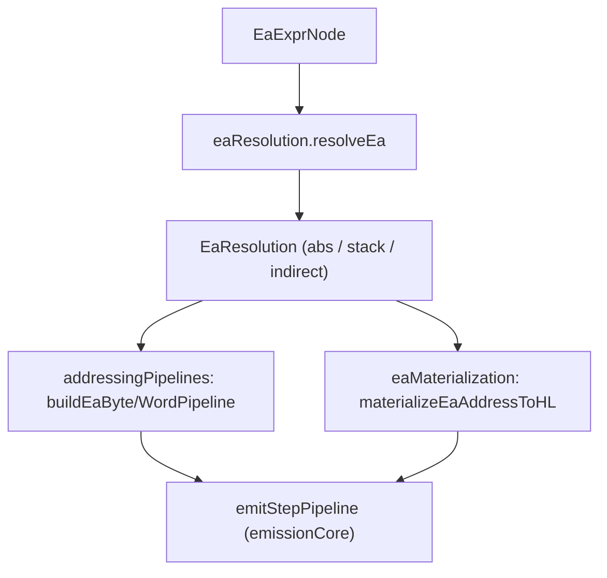

# EA Pipeline Flow (Current)

This document explains the **current** effective-address (EA) pipeline and how it is used
by lowering. It complements `docs/reference/LOWERING-FLOW.md` and the LD-specific doc by
focusing on EA resolution, step pipelines, and materialization.

## What the EA pipeline owns

The EA pipeline is responsible for:

- resolving `EaExprNode` into concrete address forms
- choosing when an EA can be expressed as a step pipeline
- materializing addresses into registers (typically HL)
- providing scalar word access helpers for common word/addr cases

## Core flow



## Stage breakdown

### 1. EA resolution (`eaResolution.ts`)

File: [`src/lowering/eaResolution.ts`](../../src/lowering/eaResolution.ts)

Responsibilities:

- Resolve names, aliases, and storage locations into:
  - `abs` (module/global symbol + addend)
  - `stack` (IX-relative displacement)
  - `indirect` (stack slot that holds an address, plus addend)
- Fold `.field` offsets and constant `[imm]` indices into `addend`/`ixDisp`.
- Validate typed reinterpret bases (reject invalid bases/unknown types).

Key outputs:

```ts
type EaResolution =
  | { kind: 'abs'; baseLower: string; addend: number; typeExpr?: TypeExprNode }
  | { kind: 'stack'; ixDisp: number; typeExpr?: TypeExprNode }
  | { kind: 'indirect'; ixDisp: number; addend: number; typeExpr?: TypeExprNode };
```

Diagnostics originate here when:

- a field/index is applied to a non-aggregate base
- field names do not exist
- indexing a non-array
- reinterpret base/type is invalid

### 2. Step pipeline construction (`addressingPipelines.ts`)

File: [`src/lowering/addressingPipelines.ts`](../../src/lowering/addressingPipelines.ts)

Responsibilities:

- Build **byte** or **word** `StepPipeline`s for EAs that can be expressed using
  the step library.
- Choose pipelines based on:
  - resolved EA kind (`abs` vs `stack`)
  - element size (byte vs word/addr, exact size for word pipelines)
  - index type (imm, reg8, reg16, EA)
- Refuse pipelines when:
  - base is `indirect` (runtime address)
  - element size is unknown or invalid
  - index form is unsupported

Key outputs:

- `buildEaBytePipeline(ea, span) → StepPipeline | null`
- `buildEaWordPipeline(ea, span) → StepPipeline | null`

### 3. Address materialization (`eaMaterialization.ts`)

File: [`src/lowering/eaMaterialization.ts`](../../src/lowering/eaMaterialization.ts)

Responsibilities:

- Materialize an EA into `HL` when:
  - direct pipelines are unavailable, or
  - callers explicitly need an address in a register
- For resolvable `abs` EAs, emits a direct `LD HL, imm16` fixup.
- Otherwise falls back to `pushEaAddress` + `pop HL`.

### 4. Scalar word access helpers (`scalarWordAccessors.ts`)

File: [`src/lowering/scalarWordAccessors.ts`](../../src/lowering/scalarWordAccessors.ts)

Responsibilities:

- Fast-path loads/stores for `word`/`addr` scalars that are:
  - `abs` with zero addend, or
  - `stack` slots
- Provides:
  - `emitScalarWordLoad(target, resolved, span)`
  - `emitScalarWordStore(source, resolved, span)`
  - `canUseScalarWordAccessor(resolved)`

These helpers are used by LD lowering and other value materialization code.

## Decision points (what happens when)

| Decision                                 | Outcome                                           | Primary file                              |
| ---------------------------------------- | ------------------------------------------------- | ----------------------------------------- |
| Field / constant index on typed base     | Fold into `addend` or `ixDisp`                    | `eaResolution.ts`                         |
| Runtime index (reg/EA)                   | Cannot fold; require pipelines or materialization | `addressingPipelines.ts`                  |
| Indirect base (stack slot holds address) | Skip pipelines; materialize                       | `eaResolution.ts`, `eaMaterialization.ts` |
| Word/addr scalar with known location     | Use scalar word accessors                         | `scalarWordAccessors.ts`                  |

## Debugging map (where to look)

- **EA resolves to wrong base**: `eaResolution.ts` (name/alias resolution, addend folding)
- **Field/index offset wrong**: `eaResolution.ts` (record/array handling)
- **Pipeline missing / falls back to HL**: `addressingPipelines.ts` (unsupported index/type)
- **Unexpected `HL` materialization**: `eaMaterialization.ts` (fallback path)
- **Word load/store not using fast path**: `scalarWordAccessors.ts` (eligibility check)

## Read this in order

1. `eaResolution.ts`
2. `addressingPipelines.ts`
3. `steps.ts`
4. `eaMaterialization.ts`
5. `scalarWordAccessors.ts`
6. `valueMaterializationContext.ts` (shared context wiring)

## Related references

- `docs/reference/LOWERING-FLOW.md`
- `docs/reference/ld-lowering-flow.md`
- `docs/reference/addressing-steps-overview.md`
