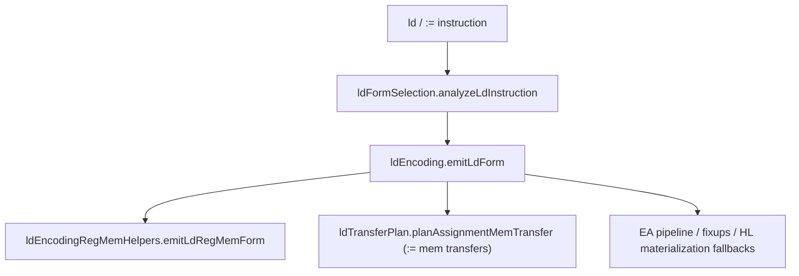

# LD Lowering Flow (Current)

This document explains the **current** LD lowering chain. It complements
`docs/reference/LOWERING-FLOW.md` by drilling into the `ld` path only.

## What the LD chain owns

The LD chain lowers `ld` / `:=` forms that touch:

- register ↔ memory (EA) transfers
- memory ↔ memory transfers
- immediate ↔ memory transfers
- address-of (`:=` with explicit `@` source)

It decides whether to use:

- direct encodings
- EA step pipelines (from `addressingPipelines.ts` / `steps.ts`)
- absolute fixups
- address materialization via HL

## Entry point and dispatch order

Entry point: `createLdLoweringHelpers` in [`src/lowering/ldLowering.ts`](../../src/lowering/ldLowering.ts).

## Stage breakdown

### 1. Form selection (`ldFormSelection.ts`)

File: [`src/lowering/ldFormSelection.ts`](../../src/lowering/ldFormSelection.ts)

Responsibilities:

- Normalize operands (`coerceValueOperand`) so scalar paths become memory operands.
- Resolve EA for memory operands.
- Compute flags used later in encoding:
  - `dstResolved` / `srcResolved`
  - scalar kinds (`dstScalarExact`, `srcScalarExact`)
  - mem→mem scalar compatibility (`scalarMemToMem`)
  - EA base hints (register-like, IX/IY disp, HL/BC/DE cases)

Output: `LdForm` (input instruction plus resolved metadata).

### 2. Transfer planning (`ldTransferPlan.ts`)

File: [`src/lowering/ldTransferPlan.ts`](../../src/lowering/ldTransferPlan.ts)

Responsibilities:

- When the opcode is `:=` and the transfer is memory-to-memory or address-of,
  pre-plan a safe transfer strategy.
- Pick hidden scratch registers/pairs (`A/B/C/D/E`, `DE`/`BC`) while avoiding
  registers referenced by the EA expressions.
- Decide whether HL must be preserved.

Output: `AssignmentMemTransferPlan` (or a diagnostic/reject).

### 3. Encoding (`ldEncoding.ts`)

File: [`src/lowering/ldEncoding.ts`](../../src/lowering/ldEncoding.ts)

Responsibilities:

- Main `emitLdForm` orchestrator:
  - First try fast register/memory forms.
  - Then handle `:=` explicit mem transfers via `ldTransferPlan`.
  - Then fall back to EA pipelines, fixups, or HL materialization.
- Handles scalar width compatibility checks (byte vs word/addr).
- Emits diagnostics for incompatible forms or impossible transfers.

### 4. Register/memory helpers (`ldEncodingRegMemHelpers.ts`)

File: [`src/lowering/ldEncodingRegMemHelpers.ts`](../../src/lowering/ldEncodingRegMemHelpers.ts)

Responsibilities:

- Implements the priority-ordered fast paths for reg/mem forms.
- Handles Z80 constraints (e.g., `LD H,(IX+d)` and `LD L,(IX+d)` are illegal)
  by shuttling through `DE` or `A`.
- Emits direct opcodes, step-pipeline templates, and fallback HL materialization
  as needed.

## Decision points and data products

| Decision                                  | Where                     | Output                                               |
| ----------------------------------------- | ------------------------- | ---------------------------------------------------- |
| Operand normalization (`Reg`/`Imm`→`Mem`) | `ldFormSelection`         | `LdForm` with coerced operands                       |
| Scalar width compatibility                | `ldEncoding`              | Diagnostics if byte/word mismatch                    |
| Mem→mem transfer strategy                 | `ldTransferPlan`          | Hidden regs/pairs + HL preservation                  |
| Fast path vs fallback                     | `ldEncodingRegMemHelpers` | Direct opcodes, step pipeline, or HL materialization |

## Diagnostics and where they originate

- **Invalid mem→mem width**: `ldEncoding` or `ldTransferPlan`
- **Unusable hidden register/pair**: `ldTransferPlan`
- **Illegal direct form**: `ldEncodingRegMemHelpers` fallback path
- **EA resolution failures**: `ldFormSelection` (indirectly via `resolveEa`)

## Debugging map (where to look)

- **Wrong form selected / unexpected mem coercion**:
  `ldFormSelection.ts` (`coerceValueOperand`, `scalarMemToMem`, register-like EA flags)
- **Mem→mem `:=` path is wrong**:
  `ldTransferPlan.ts` (scratch register selection, HL preservation)
- **Incorrect opcode bytes**:
  `ldEncodingRegMemHelpers.ts` (direct encoding helpers)
- **Unexpected fallbacks to HL**:
  `ldEncodingRegMemHelpers.ts` (pipeline vs HL materialization choice)

## Read this in order

1. `ldLowering.ts`
2. `ldFormSelection.ts`
3. `ldTransferPlan.ts`
4. `ldEncoding.ts`
5. `ldEncodingRegMemHelpers.ts`

## Related references

- `docs/reference/LOWERING-FLOW.md`
- `docs/reference/source-overview.md`
- `docs/reference/addressing-steps-overview.md`
